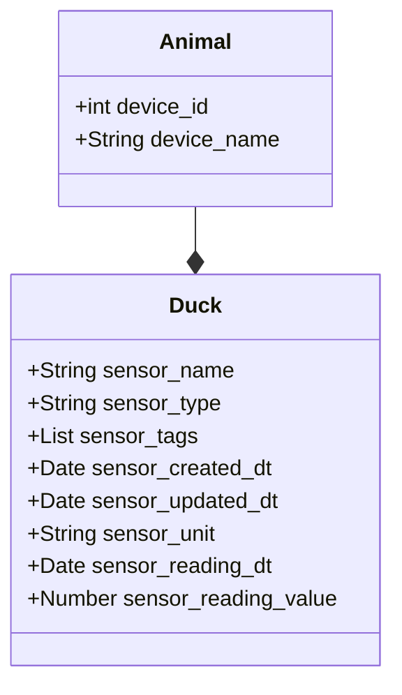

# bueno-search

## Design thoughts
### Domain 
A device comprises multiple sensors

A sensor has its own attributes like name, type,etc...

### Assumptions
* Date fields are dealt with UTC, not considered for any timezones for simplicity

