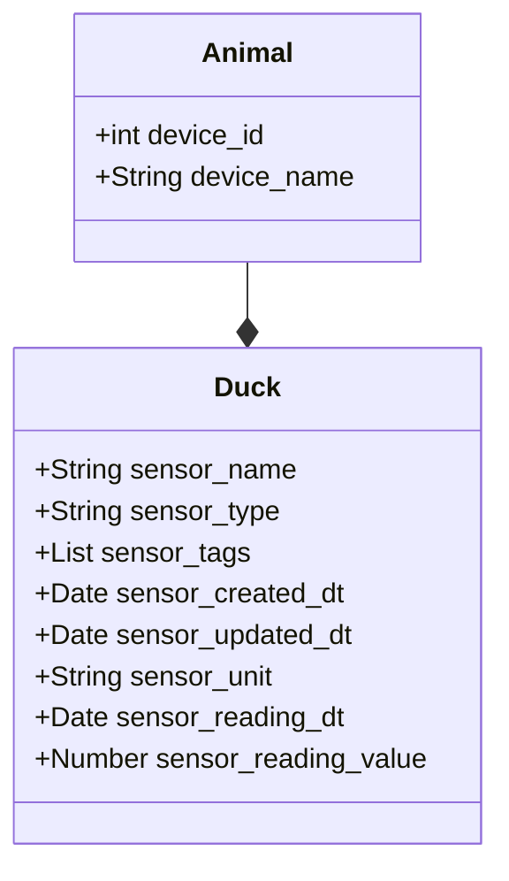

# bueno-search

## Design thoughts

### Domain

A device comprises multiple sensors

A sensor has its own attributes like name, type,etc...

### Assumptions

* Date fields are dealt with UTC, not considered for any timezones for simplicity
* Unique devices associated with `Id`
* Added a device with another Id to test search by different Id

### endpoints

- Retrieve a given device
  > http://localhost:8080/devices/e07c57cc-cf7d-4cf2-959e-b0d506929aae

- Retrieve sensor readings for a given device - returnig al the sensors belong to a device at this point because of time
  constraint
  > http://localhost:8080/sensors?sensor.readingValue=1.0

- Other properties like device name
  > http://localhost:8080/devices?device.name=_AHU1_MAIN

- Other properties like device id
  > http://localhost:8080/devices?device.name=_AHU1_MAIN

- Multiple properties like sensor name and device name
  > http://localhost:8080/devices?sensor.name=OUTDOOR_HUMID&device.name=_AHU1_MAIN

* Search query is same for both devices and sensor endpoints
* search terms are the attributes of the object with `device` or `sensor` prefix