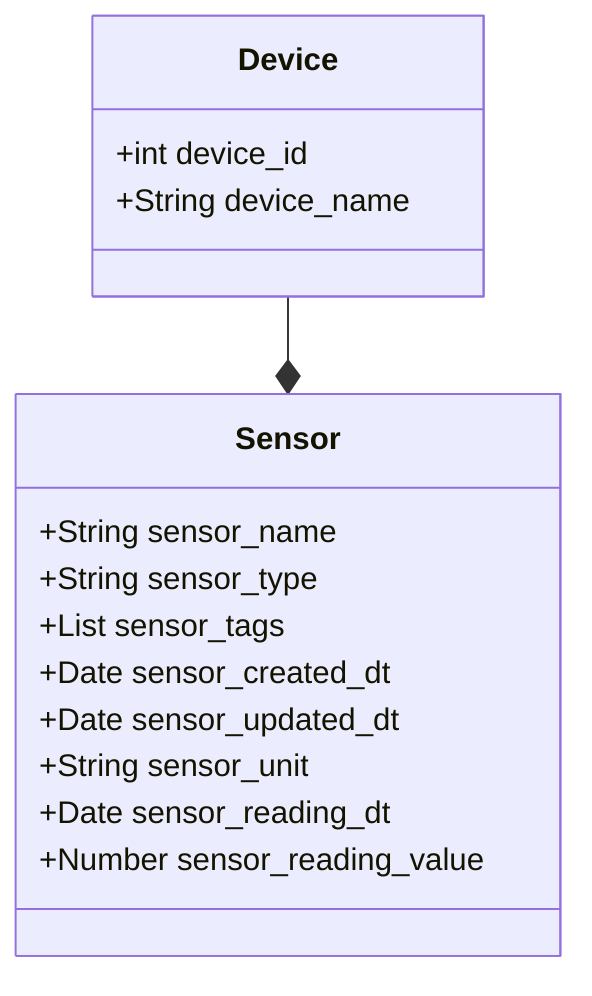
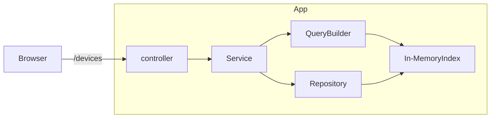

# bueno-search

## Design thoughts

### Domain

A device comprises multiple sensors

A sensor has its own attributes like name, type,etc...

Gave a shot on using springboot to build application exposing API as REST endpoints

### Assumptions & Tradeoffs

* Date fields are dealt with UTC, not considered for any timezones for simplicity
* Unique devices associated with `Id`
* Added a device with another Id to test search by different Id
* All the date are read from csv file and kept in memory to keep it simple
* Used in-memory indexing for performant search, with memory tradeoff

### endpoints

- Retrieve a given device
  > http://localhost:8080/devices/e07c57cc-cf7d-4cf2-959e-b0d506929aae

- Retrieve sensor readings for a given device - returnig al the sensors belong to a device at this point because of time
  constraint
  > http://localhost:8080/sensors?sensor.readingValue=1.0

- Other properties like device name
  > http://localhost:8080/devices?device.name=_AHU1_MAIN

- Other properties like device id
  > http://localhost:8080/devices?device.name=_AHU1_MAIN

- Multiple properties like sensor name and device name
  > http://localhost:8080/devices?sensor.name=OUTDOOR_HUMID&device.name=_AHU1_MAIN

* Search query is same for both devices and sensor endpoints
* search terms are the attributes of the object with `device` or `sensor` prefix

### Prerequisite

* Java 11,
* IDE (optional)
* gradle (depends)

## How to Run Application

Note: Data file is read from environment variable `DATA_FILE`

### Using IDE

* Import project into IDE
* set environment variable for data file
  > DATA_FILE=/Users/xyz/projects/bueno-search/src/test/resources/data.csv
* Run SearchApplication.java
* I will start webapp in `8080` port
* endpoint is accessible by http://localhost:8080/devices

### Run Test and code coverage check

* Navigate inside project directory
* `./gradlew clean build` or `./gradlew clean test jacocoTestReport`
* generate jacoco report - `./gradlew jacocoTestReport`

  